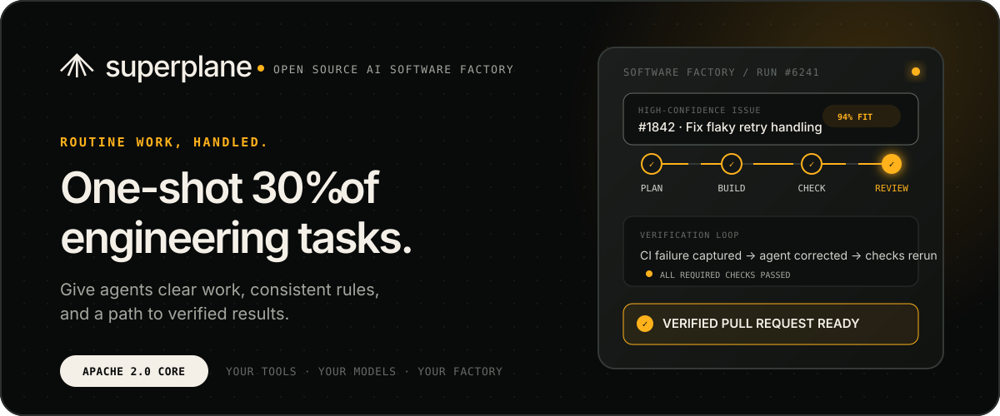

<p align="center">
  <a href="https://superplane.com">
    
  </a>
</p>

<p align="center">
  <a href="https://superplane.com">Website</a> ·
  <a href="https://docs.superplane.com">Docs</a> ·
  <a href="https://docs.superplane.com/get-started/quickstart/">Quickstart</a> ·
  <a href="https://discord.superplane.com">Discord</a> ·
  <a href="https://superplane.com/blog/">Blog</a>
</p>

## Make agents work like they should.

SuperPlane lets AI agents fully automate routine development work. Free your
team to focus on what’s important.

SuperPlane is an **open source AI software factory** for high-confidence routine
work. It coordinates coding agents, source control, CI, review, approvals, and
feedback in one visible system, turning focused issues into verified,
review-ready pull requests without engineers managing every step.

> SuperPlane does not replace the tools your team trusts. It replaces the glue
> and manual coordination between them.

## From backlog to reviewed work

| 01 / Discover | 02 / Control | 03 / Verify |
| --- | --- | --- |
| Find codebase and backlog work that can be automated with high confidence. | Define allowed scope, required checks, review policy, approvals, and escalation paths once. | Capture failures, give the agent actionable feedback, rerun checks, and return work when it is ready. |

```text
Focused issue → Plan → Build → Check ↺ Repair → Review → Verified PR
```

The workflow—not the individual agent—owns the rules. Ambiguous work or tasks
that need engineering judgment stay with your team.

## Start with work that can be scoped, checked, and reviewed

- Focused bugs and maintenance work
- Paper cuts and small product improvements
- Test fixes and flaky test repair
- Documentation and API example updates
- Routine changes with a clear, verifiable outcome

## One factory. Your standards.

- **Bring your agents.** Work with coding agents such as Claude, Cursor, and
  OpenAI alongside the rest of your engineering stack.
- **Make judgment executable.** Apply the same tests, quality thresholds,
  architecture rules, risk checks, and approvals to every run.
- **Keep every run visible.** See what ran, what failed, what changed, and where
  human attention is required.
- **Build around your constraints.** Choose your models, run in the cloud or
  on-prem, and extend the factory on the Apache 2.0 engine.

## Get started

1. Follow the [SuperPlane quickstart](https://docs.superplane.com/get-started/quickstart/).
2. Explore the [documentation](https://docs.superplane.com) and available
   [workflow components](https://docs.superplane.com/components/core/).
3. Inspect, self-host, or contribute to the
   [`superplanehq/superplane`](https://github.com/superplanehq/superplane)
   open source engine.

## Open source by design

Your factory should belong to your team. SuperPlane’s core is licensed under
Apache 2.0, so you can choose the models, infrastructure, integrations, and cost
profile that fit your organization.

| Repository | What you’ll find |
| --- | --- |
| [`superplanehq/superplane`](https://github.com/superplanehq/superplane) | Software factory engine, UI, CLI, and the main contribution surface |
| [`superplanehq/docs`](https://github.com/superplanehq/docs) | Product and self-hosting documentation sources |
| [`superplanehq/skills`](https://github.com/superplanehq/skills) | Skills that help AI agents work with SuperPlane |

Want to build with us? Browse the
[open issues](https://github.com/superplanehq/superplane/issues), pick up an
[open bounty](https://superplane.com/bounties/), or bring an idea to the
[Discord community](https://discord.superplane.com).

## Follow the factory

- Read engineering notes and release updates on the
  [SuperPlane blog](https://superplane.com/blog/).
- Meet maintainers and contributors at
  [SuperPlane community events](https://luma.com/superplane).
- Follow [@superplanehq](https://x.com/superplanehq) for product updates.
- See what we are building toward on the
  [About page](https://superplane.com/about-us/) or explore
  [open roles](https://superplane.com/careers/).

<p align="center">
  <strong>Your practices. Your tools. Your factory.</strong>
</p>
